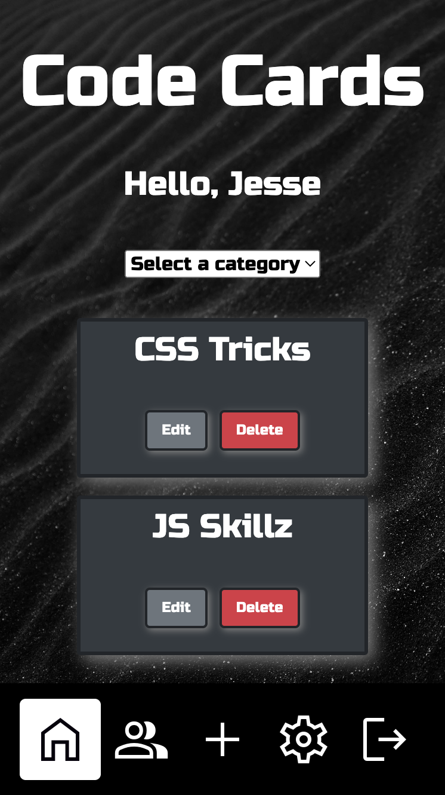

# Code Cards - Front End

**From:**

Jesse Meirink - https://github.com/jmeirink

Elijah Andrews - https://github.com/ElijahSMIAEL

Ryan Cooley - https://github.com/CoolRy1031

Pierce Petit - https://github.com/piercepetit7
  

  

This is the front end of a decoupled MERN Stack app that includes JWT Authenication. When combined with the back end found [here](https://github.com/ElijahSMIAEL/code-cards-back-end), this is an app created to give coders a place to share their code cards to learn code better.
  

### [Link to view the deployed webiste](https://sei-code-cards.netlify.app/)
[Trello Planning Materials](https://trello.com/b/MlRIyKIb/code-cards) 
[Back End GithHub Repo](https://github.com/ElijahSMIAEL/code-cards-back-end)
  

__Technologies used:__
 

 

 

 

 

 
Deploying front end with:
 

 
Deploying back end with:
 

 
  

__Credits:__ 

 
  